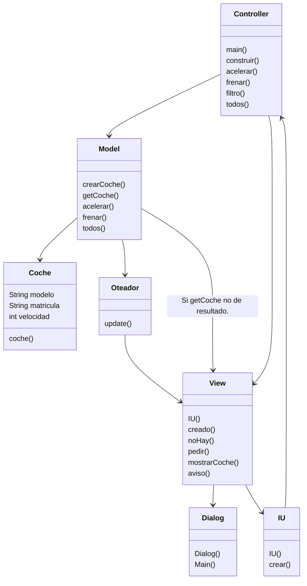
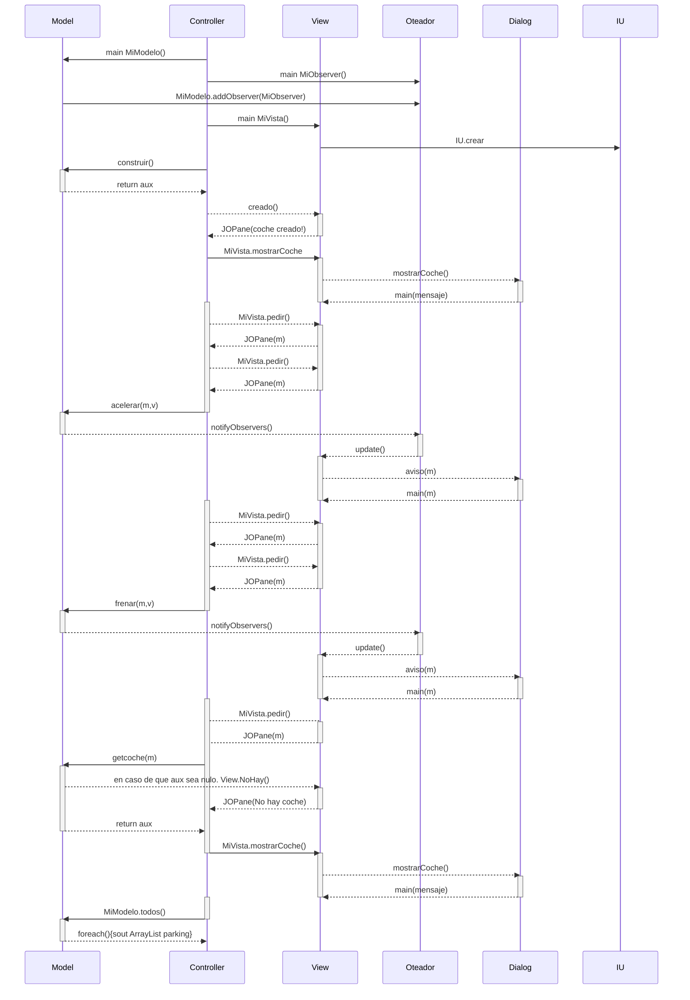

# Arquitectura MVC

Aplicación que trabaja con objetos coches, modifica la velocidad y la muestra

---
## Diagrama de clases:

---

## Diagrama de Secuencia
El diagrama de secuencia con todos los métodos de controller y comose relacionan con los demás.

