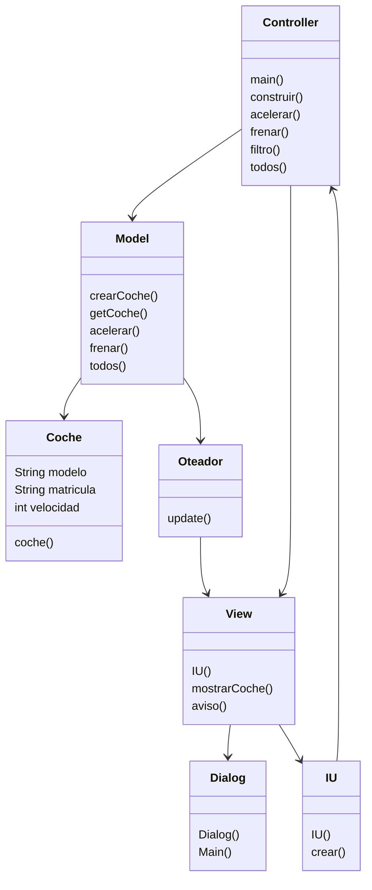

# Rama Observer

```mermaid
classDiagram
Controller-->Model
Controller-->View
Model-->Coche
Model-->Oteador
Oteador-->View
View-->Dialog
View-->IU
IU-->Controller
Controller: main()
Controller: construir()
Controller: acelerar()
Controller: frenar()
Controller: filtro()
Controller: todos() 
Model: crearCoche()
Model: getCoche()
Model: acelerar()
Model: frenar()
Model: todos()
View: IU()
View: mostrarCoche()
View: aviso()
Coche: String modelo
Coche: String matricula
Coche: int velocidad
Coche: coche()
Oteador: update()
IU: IU()
IU: crear()
Dialog: Dialog()
Dialog: Main()
```